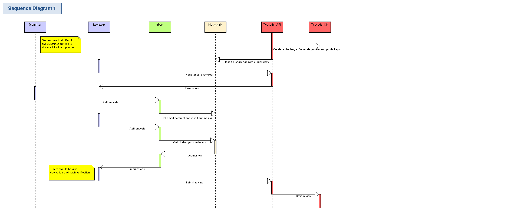

# uport-app

## Requirements
- nodejs v8.9
- yarn v1.3

## Description
The application solves a real problem for Topcoder platform and helps members to submit their submission to Topcoder website.

Currently, users face following problems:
- Internet connection to Topcoder can be slow from some places. Members live in many locations, and Topcoder servers are located in the US.
- They have a slow internet connection and must upload big files (sometimes 100MB+).
- Topcoder website has stability issues and is not available very often.
- Members try to submit their submissions 5-10 minutes before the deadline, and if they have any problems, they must submit it manually to Topcoder via email.

Challenges rules:
- Each member must submit his submission before the deadline. Late submissions are never accepted. 
- The submission content can't be visible to other members (except reviewers).

The problem when submitting the submission via email:
- Topcoder support must add submissions to Online Review (system for submissions), and it causes delays in the review phase.
- Topcoder support must do manual verification if the submission is valid. They must check timestamp if it was sent before the deadline. Check if the content was not modified (e.g. google drive provides it).
- Other members don't know if there were any mistakes in manual verification. They must trust Topcoder support.

Solution:
- Using blockchain, the member can submit his submission information (download URL + content hash).
- A smart contract checks for the submission deadline.
- Using uPort ID, the user can easily sign his transaction.
- It's possible to submit to Topcoder if the website is down. The uPort api must work, blockchain and the service for file uploading (AWS S3).


Diagram


## Install

```bash
$ yarn
```


## Run production mode

```bash
$ yarn run build
$ yarn start
```


## Run dev mode

```bash
$ yarn run dev
```

## Packaging

To package apps for the local platform:

```bash
$ yarn run package
```

To package apps for all platforms:

First, refer to [Multi Platform Build](https://www.electron.build/multi-platform-build) for dependencies.

Then,
```bash
$ yarn run package-all
```

To package apps with options:

```bash
$ yarn run package -- --[option]
```

## Contract setup
Optional setup. The source file already contains valid sample data.  


Install truffle cli
```
npm install -g truffle
truffle migrate --network rinkeby --compile-all --reset
```
Deploy contract
```
truffle migrate --network rinkeby --compile-all --reset
```
Run console
```
truffle console --network rinkeby 
// get contract address
TopCoderChallenges.address)
// create sample challanges
var tc = TopCoderChallenges.at(TopCoderChallenges.address)
tc.addChallenge("Expired challenge", 1, 2, 'public rsa key')
tc.addChallenge("Some challenge", 2, 1612504683, 'MIGJAoGBAM3CosR73CBNcJsLv5E90NsFt6qN1uziQ484gbOoule8leXHFbyIzPQRozgEpSpi\nwhr6d2/c0CfZHEJ3m5tV0klxfjfM7oqjRMURnH/rmBjcETQ7qzIISZQ/iptJ3p7Gi78X5ZMh\nLNtDkUFU9WaGdiEb+SnC39wjErmJSfmGb7i1AgMBAAE=');

```
